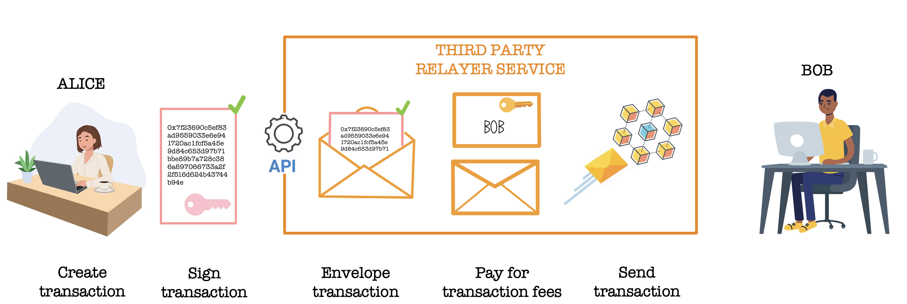

# 🚀 Relayer Service Workshop – Gasless Transactions

📍 Crecimiento Conference in Buenos Aires

Welcome to this hands-on workshop! In this session, you'll learn how to build a simple **Relayer Service** that enables **gasless blockchain transactions** using **LUKSO's LSP15 Transaction Relay Standard**.

> **Note**
> Full slides of the presentation available [here](https://docs.google.com/presentation/d/1gJa_WLCzG8sALqvL6nkwIhxLuqA59tEC/edit?usp=sharing&ouid=113684602982664573986&rtpof=true&sd=true).

## 🔍 What You'll Learn

- Why gasless transactions improve user onboarding
- How a relayer service works
- How to implement and run your own relayer service

## 🧠 How It Works



1. User signs transaction + Sends it to the Relayer
2. Relayer verifies signature + Pays for fees + Broadcasts transaction
3. Blockchain executes transaction

## 🔐 Setup

```bash
cp .env.example .env
```

Install dependencies

```bash
yarn
```

## 👩‍💻 As a developer, Run a Relayer Service

Start the Relayer Service

```bash
yarn dev
```

This command will generate the types of the smart contracts and start the server.
Your relayer API is now running at `http://localhost:3000` by default.

## 💁‍♀️ As a user, Send a transaction to the Relayer

Specify parameters in `./scripts/inputs.json`: Universal Profile Address and Private Key.
This step can be done from the browser extension.

```bash
yarn run execute inputs.json
```

This command will generate a transaction, sign it with your private key and send it to the Relayer Service which will then process it.

[Detailed script](./docs/endpoint.md)

## 🌱 Next Steps

- Nonce management
- Batch transactions
- Business model

## 📚 More Resources

- 🎙️ [EthCC[7]](https://ethcc.io/archives/onboarding-new-users-using-a-gasless-transaction-tool):
  Exploring different business models to make it cost effective or even profitable for Relayer services.
  [9min]

Showing how to integrate a Relayer Service to your dApp. [12min]

- 📖 [LSP15 Transaction Relay Standard Docs](https://docs.lukso.tech/standards/accounts/lsp15-transaction-relayer-api)

- ⚒️ [Erc725-inspect](https://erc725-inspect.lukso.tech/): Inspect your Universal Profile contract storage
